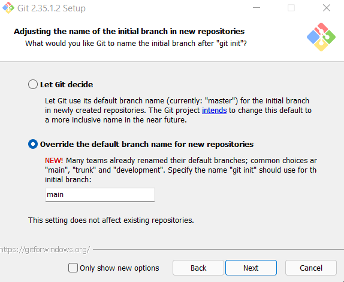

# Git 

```{r pressuree, echo=FALSE, out.width = '80%'}
knitr::include_graphics("https://git-scm.com/images/logos/downloads/Git-Logo-2Color.png")
```

O Git é um sistema de controle de versão(popularmente conhecido como, versionamento). Cuja finalidade é gerenciar diferentes versões de um documento. Ele é muito utilizado por empresas e grupos com grandes equipes de pessoas para acompanhar as alterações e coordenar a colaboração entre uma equipe.

Alguns exemplos de projetos que utilizam o Git são: R, Python, Visual Studio Code, Linux, entre outros.

## Instalando o Git

Nos próximos itens iremos aprender como instalar o Git no Windows e Linux.

### Windows

- Acesse o site: [Git](https://git-scm.com/downloads) e selecione o Sistema Operacional Windows.


- Em seguida abra o arquivo executável no seu computador. Clique em _Next_. Quando chegar nessa tela, o Instalador do Git irá perguntar qual editor você prefere utilizar como padrão para o Git:

```{r git01, echo=FALSE, out.width = '80%'}
knitr::include_graphics("imgs/git01.png")
```

Você escolher o seu editor preferido da lista, caso queira. Por padrão, o Git irá utilizar o [Vim](https://www.vim.org/)


- Ao avançar na Instalação, o Git irá perguntar se você gostaria de ajustar o nome da branch principal depois de usar o comando `git init`.

- Após o início dos protestos do "Black Lives Matter", retomados após o assassinato de George Floyd no final de maio de 2022, o projeto Git tem incentivado os seus usuários a não utilizar mais terminologias que envolvem a discriminação racial ou faz referência ao período de escravidão. Desde então, é uma boa prática na comunidade que a branch principal se chame `main` ao invés de `master`. 

```{r git02, echo=FALSE, out.width = '80%'}

```

- Em seguida prossiga a instalação como _Default_ em todas as opções.


- Protinho, seu Git está instalado em seu Windows.

### Linux

Para instalar o Git em qualquer ambiente Linux, basta apenas abrir o seu terminal (neste tutorial estamos considerando a distribuição Ubuntu) e digitar:

```{shell, setupgit, include=TRUE}
sudo apt install git
```

Feito! O Git está instalado no seu Linux! 