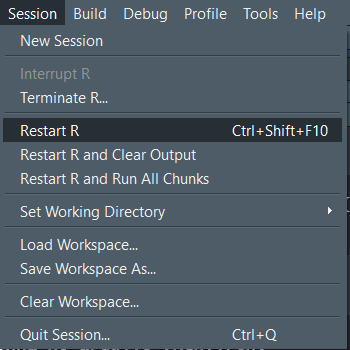

# Rstudio {#rstudio}

Agora que configuramos o Git em nosso computador e criamos uma conta n Github, chegou a hora de configurar ambos no nosso ambiente do Rstudio.

## Pacote usethis

O pacote `{usethis}` é um pacote que ajuda com todo o fluxo de desenvolvimento em no R. Ele nos ajuda a criar os arquivos, configurar o Git, criar os repositórios no Github, criar as licenças, Readme e etc.

```{r usethis, echo=FALSE, out.width = '80%'}
knitr::include_graphics("https://usethis.r-lib.org/logo.png")
```

### Instalando o Usethis

Para instalar o usethis, digite no console ou crie um arquivo `configgit.R` no seu Rstudio:

```{rcode, usethispackage, include=TRUE}
install.packages("usethis")
```

### Configurando Git e Github com Usethis

```{rcode, configusethis, include=TRUE}
# Informar para o Git seu nome, e email
usethis::use_git_config(
  # Seu nome de usuario no github:
  user.name = "gabrielDjusto", 
  # Seu email cadastrado no github:
  user.email = "")

#NENHUMA MESSAGEM SURGIRÁ APÓS O USO DO COMANDO ACIMA
```

#### Crie um _Personal Access Token_ (PAT)

O pat serve  para autenticar ao GitHub, podendo ser utilizado como senha de 
#acesso ou internamente para automatizar tarefas (como criar um repositório).

```{rcode, pat, include=TRUE}
usethis::create_github_token()
```

Em seguida, Use a função usethis::edit_r_environ() para abrir o arquivo .Renviron para salvar seu token

```{rcode, renviron, include=TRUE}
usethis::edit_r_environ()
```

Crie uma nova linha no arquivo .Renviron:

```{rcode, renvirontoken, include=TRUE}
GITHUB_PAT="seu token"
```

Pule uma linha e salve o arquivo. Se certifique que o arquivo termine com uma linha vazia!

Vá em Session > Restart R (reinicie a sessão do R):

```{r rrestart, echo=FALSE, out.width = '80%'}

```

Para checar se as configurações deram certo, digite:

```{rcode, gitsirep, include=TRUE}
usethis::git_sitrep()
```

As informações abaixo precisam aparecer:

```{rcode, gitsirepoutput, include=TRUE}
# Git config (global)
# * Name: 'Seu nome de usuario no github'
# * Email: 'Seu email cadastrado no github'
# * Global (user-level) gitignore file: <unset>
#   
#   
# * Personal access token for 'https://github.com': '<discovered>'
```

OBS: "<discovered>" é importante que apareça! Caso contrário, houve algum erro em etapas anteriores

```{rcode, gitcreds_set, include=TRUE}
gitcreds::gitcreds_set()
```

### Utilizando o Usethis
#### Inciando o Git
Para iniciar o Git pelo usethis, digite:

```{rcode, usethisgit, include=TRUE}
usethis::use_git()
#Para adicionar funcionalidades diferentes use branches
```

- O arquivo `.gitgnore` contém arquivos que não desejamos que sejam incluídos no repositório do Github. 

- O arquivo `.Renviron` é utilizado principalmente para senhas do projeto portanto, adicione tal arquivo no `.gitgnore`.

### Criando um repositorio no Github

- Crie um Projeto no Rstudio

```{rcode, repoprivate, include=TRUE}
usethis::use_github(
  #Criando um repositório público:
  private = TRUE) #TRUE consiste em um repo privado
```

- Crie o arquivo `README`: É um texto em formato rmarkdown contendo o que será feito naquele repositório. Criado com a função:

```{rcode, readme, include=TRUE}
usethis::use_readme_rmd()
```